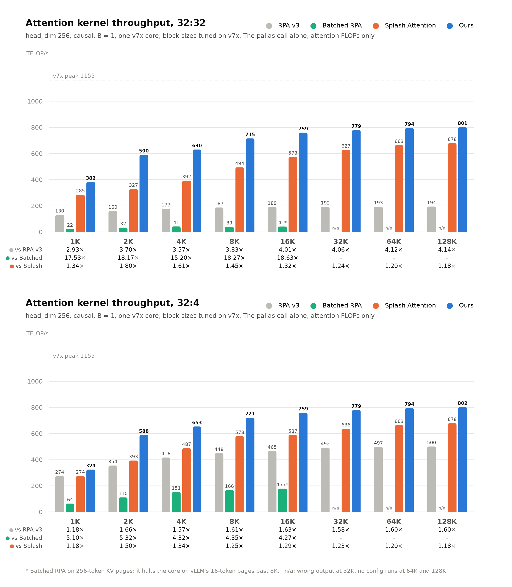

# FlyWheel on TPU v7x

The benchmarks in the [README](README.md) were measured on v6e. This page has
the softmax attention benchmark on v7x, measured the same way and on the same
stack, `jax[tpu]==0.11.0` and `libtpu==0.0.44`.

## Softmax attention

Causal prefill on one v7x core, head_dim 256, B = 1, for 32:32 (MHA)
and 32:4 (GQA) heads. The rows under each sequence length are our speedup
over [RPA v3](https://github.com/vllm-project/tpu-inference/tree/4420cae/tpu_inference/kernels/ragged_paged_attention/v3), [batched RPA](https://github.com/vllm-project/tpu-inference/tree/4420cae/tpu_inference/kernels/experimental/batched_rpa) and [Splash Attention](https://github.com/openxla/tokamax/tree/84e5f36/tokamax/_src/ops/experimental/tpu/splash_attention).



Every number comes from
[`benchmarks/softmax_attention/`](benchmarks/softmax_attention/), with the
block, the timing and the trace split described in the
[README](README.md#softmax-attention). Four things differ on v7x:

- **One device is one core.** A v7x chip has two TensorCores and JAX lists
  each as a device, so the `jax.devices()[0]` the benchmark runs on is half a
  chip. The dashed line is that core's bf16 peak,
  `pltpu.get_tpu_info().bf16_ops_per_second`.
- **The block configs are tuned on v7x.** A v7x core has 64 MiB of VMEM, less
  than the configs searched on v6e need: RPA v3's v6e entries run out of VMEM
  on 15 of the 16 cells, and Splash Attention's at 64K and 128K. So
  [`tune_blocks.py`](benchmarks/softmax_attention/tune_blocks.py) searched
  every kernel per cell on v7x, into `rpa_tuned_v7x.json`,
  `batched_rpa_tuned_v7x.json`, `splash_tuned_v7x.json` and the `"TPU v7"`
  section of [`tuned_configs.json`](flywheel_tpu/tuned_configs.json), and
  `attention_block.py` reads the tables of the chip it runs on. At 32:32 RPA
  v3's own v7 default formula runs out of VMEM as well, on every cell; what
  fits is `[128, 256, 128, 256]`, which is its tuned config from 1K to 128K.
  flywheel's analytic defaults were already close: tuning moved its kernel by
  about 2% at the median, and by 22% at 1K for 32:32, where it folds heads.
- **The trace split reads the TensorCore only.** On v7x XLA offloads RPA v3's
  relayout copies to the SparseCores, which adds their processes to the
  trace. `segments.py` leaves them out: the TensorCore's wait for them is
  already on its own timeline, in the `layout` segment.
- **Batched RPA is a fourth backend, and only runs to 16K.** It is
  tpu-inference's experimental batched kernel, loaded from the same pinned
  submodule as RPA v3 (`4420cae`; the directory is unchanged on `main` as of
  2026-09-30) and given the inputs and paged KV cache RPA v3 gets. Its kernel
  segment is its `RPAm-...` Pallas call; the `rpa_metadata_schedule` kernel
  it runs first, which upstream amortizes across layers, lands in `other`
  (0.17 ms at 1K and 11.4 ms at 16K for 32:32). On v7x:
  - the block sizes it calculates for itself run out of VMEM on every 32:32
    cell, so it runs on tuned ones here, as the others do;
  - on the 16-token KV pages vLLM uses past 8K it halts the core
    (`E0200: RuntimeUnexpectedCoreHalt`), so its 16K cell, marked \*, runs
    on 256-token pages, which its table records and `attention_block.py`
    applies, while RPA v3 stays on 16;
  - at 32K it runs on 256-token pages but its output does not match exact
    causal attention, and at 64K and 128K no config we tried runs, so those
    cells are empty.

Kernel level, TFLOP/s, which the figure plots:

| 32:32 | RPA v3 | Batched RPA | Splash Attention | flywheel | vs RPA v3 | vs Batched RPA | vs Splash |
|---|---|---|---|---|---|---|---|
| 1K | 130 | 22 | 285 | 382 | 2.93x | 17.53x | 1.34x |
| 2K | 160 | 32 | 327 | 590 | 3.70x | 18.17x | 1.80x |
| 4K | 177 | 41 | 392 | 630 | 3.57x | 15.20x | 1.61x |
| 8K | 187 | 39 | 494 | 715 | 3.83x | 18.27x | 1.45x |
| 16K | 189 | 41\* | 573 | 759 | 4.01x | 18.63x | 1.32x |
| 32K | 192 | – | 627 | 779 | 4.06x | – | 1.24x |
| 64K | 193 | – | 663 | 794 | 4.12x | – | 1.20x |
| 128K | 194 | – | 678 | 801 | 4.14x | – | 1.18x |

| 32:4 | RPA v3 | Batched RPA | Splash Attention | flywheel | vs RPA v3 | vs Batched RPA | vs Splash |
|---|---|---|---|---|---|---|---|
| 1K | 274 | 64 | 274 | 324 | 1.18x | 5.10x | 1.18x |
| 2K | 354 | 110 | 393 | 588 | 1.66x | 5.32x | 1.50x |
| 4K | 416 | 151 | 487 | 653 | 1.57x | 4.32x | 1.34x |
| 8K | 448 | 166 | 578 | 721 | 1.61x | 4.35x | 1.25x |
| 16K | 465 | 177\* | 587 | 759 | 1.63x | 4.27x | 1.29x |
| 32K | 492 | – | 636 | 779 | 1.58x | – | 1.23x |
| 64K | 497 | – | 663 | 794 | 1.60x | – | 1.20x |
| 128K | 500 | – | 678 | 802 | 1.60x | – | 1.18x |

Block level, wall clock of the whole block in ms, from runs with no profiler
in the process:

| 32:32 | RPA v3 | Batched RPA | Splash Attention | flywheel | vs RPA v3 | vs Batched RPA | vs Splash |
|---|---|---|---|---|---|---|---|
| 1K | 1.023 | 1.887 | 0.689 | 0.682 | 1.50x | 2.77x | 1.01x |
| 2K | 2.122 | 4.189 | 1.476 | 1.379 | 1.54x | 3.04x | 1.07x |
| 4K | 4.792 | 10.552 | 3.467 | 2.940 | 1.63x | 3.59x | 1.18x |
| 8K | 12.336 | 37.399 | 7.202 | 6.515 | 1.89x | 5.74x | 1.11x |
| 16K | 36.065 | 131.965\* | 17.568 | 15.674 | 2.30x | 8.42x | 1.12x |
| 32K | 117.371 | – | 47.857 | 42.351 | 2.77x | – | 1.13x |
| 64K | 416.074 | – | 150.139 | 128.196 | 3.25x | – | 1.17x |
| 128K | 1556.801 | – | 503.458 | 430.544 | 3.62x | – | 1.17x |

| 32:4 | RPA v3 | Batched RPA | Splash Attention | flywheel | vs RPA v3 | vs Batched RPA | vs Splash |
|---|---|---|---|---|---|---|---|
| 1K | 0.581 | 0.906 | 0.423 | 0.420 | 1.38x | 2.16x | 1.01x |
| 2K | 1.076 | 1.717 | 0.895 | 0.832 | 1.29x | 2.06x | 1.08x |
| 4K | 2.375 | 3.954 | 1.983 | 1.843 | 1.29x | 2.15x | 1.08x |
| 8K | 5.668 | 10.999 | 4.715 | 4.329 | 1.31x | 2.54x | 1.09x |
| 16K | 15.457 | 33.964\* | 13.038 | 11.322 | 1.37x | 3.00x | 1.15x |
| 32K | 47.732 | – | 38.788 | 33.612 | 1.42x | – | 1.15x |
| 64K | 165.722 | – | 128.563 | 110.790 | 1.50x | – | 1.16x |
| 128K | 611.513 | – | 459.806 | 395.692 | 1.55x | – | 1.16x |

To reproduce the figure, sequentially on a v7x VM:

```bash
git submodule update --init third_party/tpu-inference third_party/tokamax
IMPLS="rpa batched_rpa splash flywheel" \
    benchmarks/softmax_attention/attention_block.sh results/benchmark/softmax_attention_v7x
```

The batched RPA cells from 32K up have no table entry and fail; the script
logs them and goes on.

### Tuning the block configs

`tune_blocks.py` searches one cell at a time, timing the kernel alone. From
the kernel's own default and its v6e entry it sweeps one config field at a
time, keeps the fastest and repeats until a pass gains under 1%, then times
the fastest few again with the benchmark's protocol. A candidate that aborts
the process, hangs or halts the core is logged before it runs, so running the
same command again resumes past it:

```bash
PYTHONPATH=. uv run --no-sync python benchmarks/softmax_attention/tune_blocks.py \
    --impl rpa --heads 32 --heads-k 4 --head-dim 256 --seq 8192 \
    --output results/tune/softmax_attention
```

Searches of different cells can run side by side, one per chip, with
`TPU_VISIBLE_CHIPS=<chip> TPU_CHIPS_PER_HOST_BOUNDS=1,1,1 TPU_HOST_BOUNDS=1,1,1`
in front of the command. `--page-size` searches RPA v3 or batched RPA on a KV
page size other than vLLM's default, which is how the batched RPA 16K cells
were searched (`--page-size 256`). Once every cell has a best config, write
the tables:

```bash
PYTHONPATH=. uv run --no-sync python benchmarks/softmax_attention/tune_blocks.py \
    --collect results/tune/softmax_attention --device-tag v7x
```

## Not on v7x yet

The fused GDN and KDA kernels and `flash_attn_varlen_func` do not compile on
v7x with this stack. Mosaic stops at
`E2003: CompileTimeMosaicUnprovenMemoryAccessAlignment: cannot statically
prove that index in dimension 0 is a multiple of 16` (dimension 1 for varlen):
v7x tiles bf16 VMEM in 16 rows, and these kernels address it in 8-row slabs.
So the README's linear attention benchmark has no flywheel number on v7x. Its
`gdn_v3` baseline runs, at 6.4 to 9.0 M tokens/s for n_v = 16.
